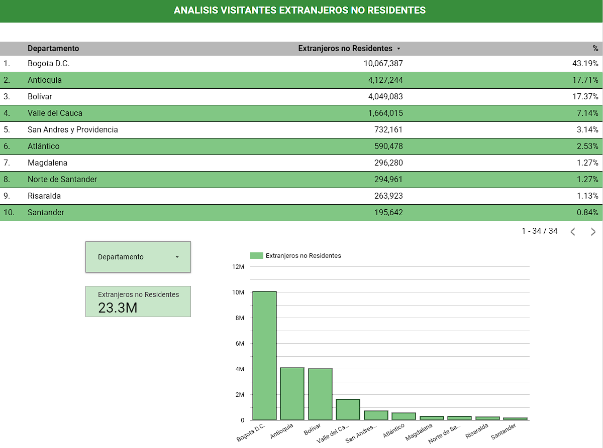

Puedes acceder a la pagina de datos abiertos de colombia haciendo click [aqui](https://www.datos.gov.co/Comercio-Industria-y-Turismo/Visitantes-No-Residentes/bkar-zsub/about_data)

Puedes ver el Dashboard haciendo click [aqui](https://lookerstudio.google.com/u/0/reporting/2255acc3-d233-4857-ad62-23c0b9be8d03/page/NSd8D).

